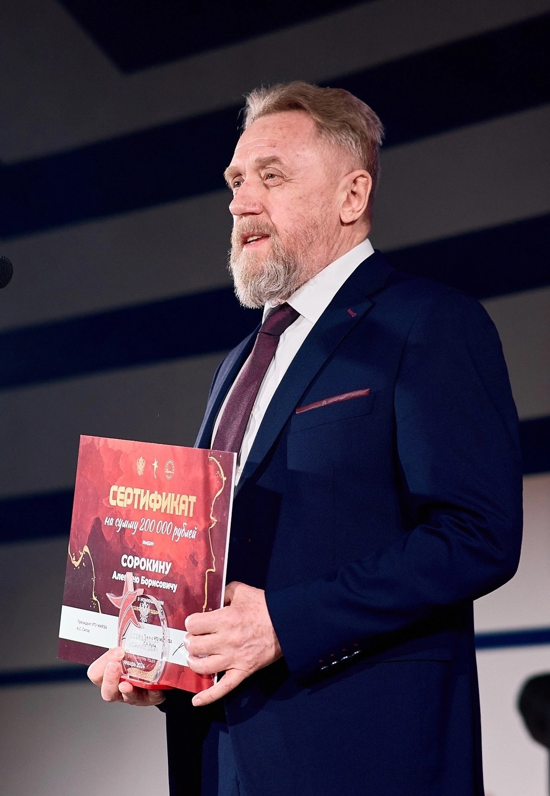

# Информация о дисциплине

Репозиторий представляет материалы по дисциплине ***Проектирование и обучение нейронных сетей, часть первая***, прочитанной в **2024** году.

Дисциплина прочитана кафедрой ***Вычислительной техники (ВТ)***

Курс лекций провёл
***Сорокин Алексей Борисович***,
кандидат технических наук, доцент кафедры вычислительной техники,
лауреат звания «Преподаватель года».

  
   
  <strong>Рисунок 1 - Сорокин Алексей Борисович</strong>

Практические занятия курса провёл
***Семёнов Роман Эдуардович***,
практикующий специалист в области машинного обучения и нейронных сетей.

  
   
  <strong>Рисунок 2 - Семёнов Роман Эдуардович</strong>

В папке ***Лекции*** находятся pdf-файлы лекций курса, в папке ***Экзамен*** лежат ответы на билеты. Для каждой практической работы создана отдельная папка. Отчет по практическим работам доступен в форматах ***.docs*** и ***.pdf***.

# Практическая часть

Практическая часть курса включала выполнение работ по следующим темам:
1. **Обучение по правилам Хебба**
2. **Дельта правило**
3. **Обратное распространение ошибки**
4. **Радиально-базисные функции**
5. **Карта Кохонена**
6. **Встречное распространение**
7. **Рекуррентные сети**
8. **Сверточные сети**

Модели используют датасет [Banana Quality](https://www.kaggle.com/datasets/l3llff/banana/data), который также представлен в исходных файлах.